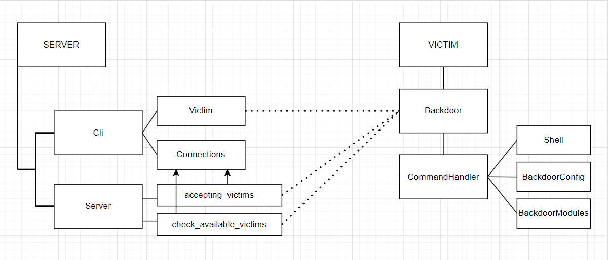

# Newton RAT
Newton RAT is a malware written in Python and purposed for remote access to victim's PC

The Malware is developed to show how malware can work and how to deal with it

## What can Hewton RAT do?
As said above, Hewton RAT is a remote access tool, so malware operator can manage victim's PC

Malware operator start server CLI, enter commands and the commands send to victim's PC

You should run `python server.py` to start server CLI

Then you can use this commands:
- *(0) Show server commands*
- *(1) List of victims*
- *(2) Connect to victim*
- *(3) Send command to all victims*
- *(4) Exit*

You need to enter command number to execute the command
## Installation Hewton RAT on victim's PC

## How does it work?

There are 2 main classes (***CLI*** and ***Server***) on the ***server side*** 
and 1 main class (***Backdoor***) on the ***client side***.

- CLI (*main thread*) sends commands to Backdoor
- acceptings_victims *thread* accepts new victims
- check_available_victims *thread* checks is victims available

You can check how it works on the video [link](https://youtu.be/JAEwzAu24ac)

## Compilation
You should set up project variables in local_libs/env_vars.py file and change default values

1. For server: `compile server`
2. For malware: `compile malware`

## How to remove Hewton RAT?
Removing the malware is pretty easy because service permissions are not set up when malware installed. 
Therefore, you just need to stop the malicious process in the process manager running with administrator rights.
